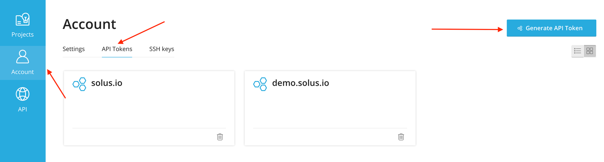
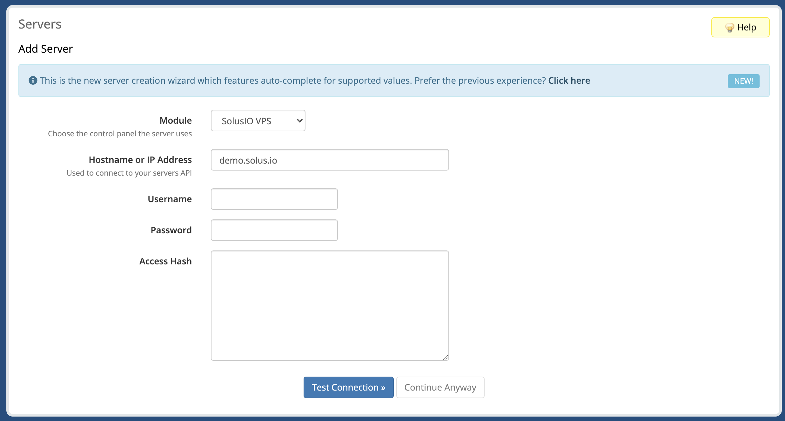
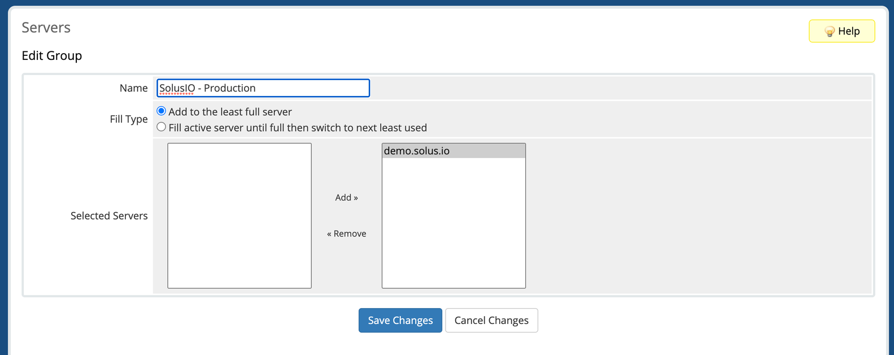
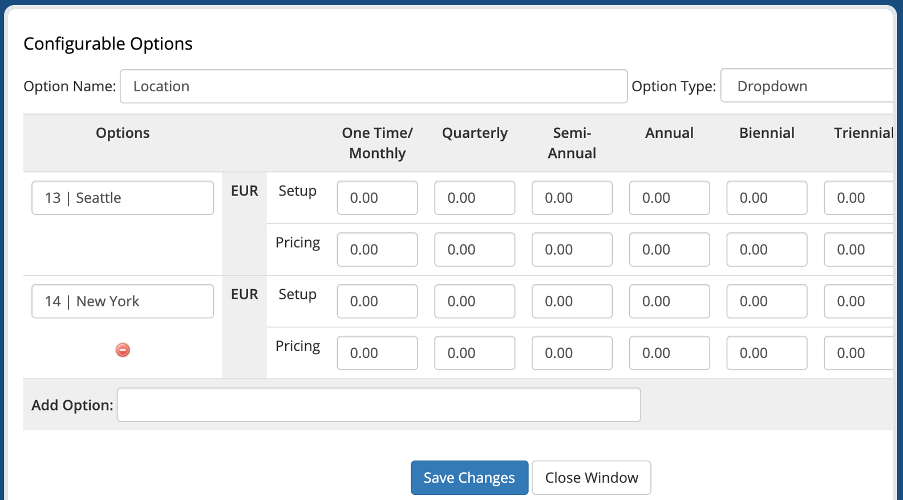
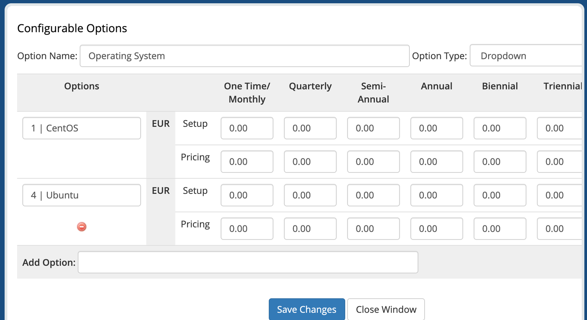
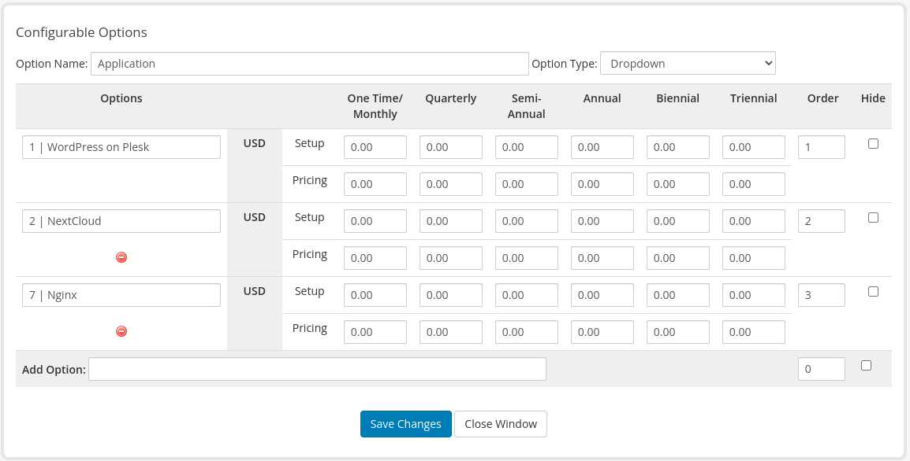
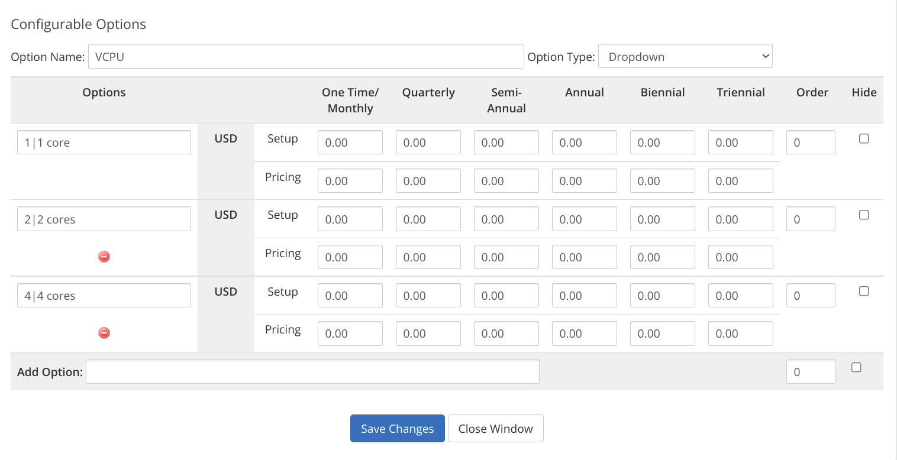
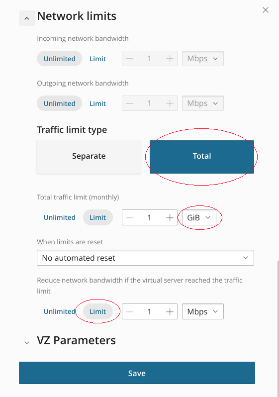
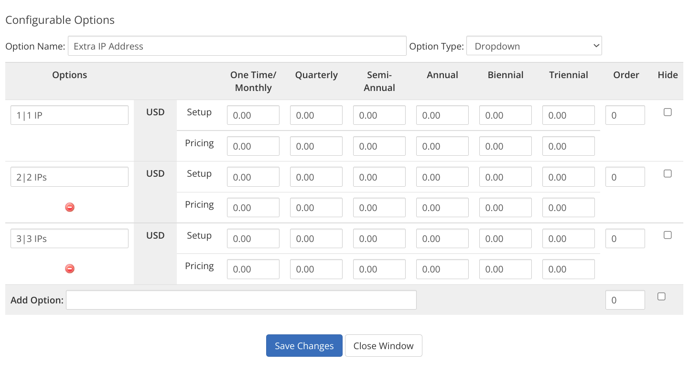

# SolusIO WHMCS VPS Provisioning module

## Description

SolusIO WHMCS VPS Provisioning module gives the ability to sell traditional-style prepaid VPS.

The module allows you to do the following virtual server actions:

* create
* destroy
* suspend
* unsuspend
* reboot
* boot
* shutdown

## Requirements

Minimum required **PHP** version is 7.4.

## Installation

* Download the latest package from our [releases page](https://github.com/solusio/solusiovps/releases)
* Extract the contents of the zip file to your WHMCS root directory

## Module setup with SolusIO server

Open the Account page in the SolusIO user-area to generate an API Token.

Configure SolusIO API access by adding a new server in WHMCS. Required fields are `Hostname` and `Password`.

`Hostname` must contain URL without https, e.g. "www.solus.io"

SolusIO API Token should be saved in the password field.

Create a server group in WHMCS and assign the server which was created on the previous step.

## Product Configuration

Create a product in WHMCS and select `SolusIO VPS` as the linked module and the server group you configured previous.

Select the `Plan`, `Default Location` and `Default Operating System` or `Application` and save changes. If application is selected then the operating system is ignored.

### Optional Configuration

#### Locations

The module gives the ability to select a specific location while ordering a product. You can manage the list of available locations in the Configurable Options.

Create a configurable option named `Location`. Add options with the following convention: `locationId|locationName`. The option will have higher priority over the selected location in the Module Settings of a product.

#### Operating Systems

The module gives the ability to select a specific operating system while ordering a product. You can manage the list of available operating systems in the Configurable Options.

Create a configurable option named `Operating System`. Add options with the following convention: `osId|osName`. The option will have higher priority over the selected operating system in the Module Settings of a product.

#### Applications

The module gives the ability to select a specific application while ordering a product. You can manage the list of available applications in the Configurable Options.

Create a configurable option named `Application`. Add options with the following convention: `applicationId|applicationName`. The option will have higher priority over the selected application in the Module Settings of a product. If client chooses both `Operating System` and `Application` then the `Operating System` option will be used.

#### Plan parameters

The module gives the ability to select specific plan parameters such as `VCPU`, `Memory`, `Disk Space`, `Total traffic limit monthly` (for KVM and VZ), `VCPU Units`, `VCPU Limit`, `IO Priority`, and `Swap` (for VZ) while ordering a product.
You can manage the list of available plan parameters in the Configurable Options.

Create a configurable option with one of the following names: `VCPU`, `Memory`, `Disk Space`, `Total traffic limit monthly`, `VCPU Units`, `VCPU Limit`, `IO Priority`, or `Swap`. Add options with the following convention: `planParamValue|planParamTitle`. The option will have higher priority over parameters of the selected plan in the Module Settings of a product.

`planParamValue` for the `Memory` and the `Swap` set in MiB (e.g. `4096|4 GiB`).

`planParamValue` for the `Disk Space` set in GiB (e.g. `20|20 GiB`).

`planParamValue` for the `Total traffic limit monthly` set in units, which are specified in the `Total Traffic limit` option of the plan selected in Module Settings of a product in SolusIO (e.g. `1|1 GiB` if the `Total Traffic limit` unit is `GiB` or `1024|1 Gib` if the `Total Traffic limit` unit is `MiB`).
`Total traffic limit monthly` option can only be used if the plan selected in Module Settings of a product has the `Total Traffic limit` option enabled in SolusIO.

#### Extra IPs

The module gives the ability to select the count of additional IPs while ordering a product. You can manage the list of allowed values in the Configurable Options.

Create a configurable option named `Extra IP Address`. Add options with the following convention: `ip count|title`.
`Extra IP Address` option can only be used if the plan selected in Module Settings of a product has the `Offer additional IP addresses` option enabled in SolusIO.

#### SSH Key

The module gives the ability to specify an SSH key while ordering a product. This is done in the form a product custom field.

Create a custom field named `SSH Key` and type `Text Area`.

#### Applications

Create corresponding product custom fields for applications with the same property names as defined in SolusIO.

## Product upgrade/downgrade

It is possible to use product Upgrade/Downgrade feature to change product type in admin area. To do this select `New Product/Service` with another SolusIO package in Upgrade/Downgrade dialog of admin area.
After order is complete this will trigger server resize action on SolusIO side.

## Other configurations

There are several options that can be configured within module config file `config.php`

- `delete_solus_user` - request SolusIO user deletion when user account is terminated if the value is set to `true`
- `default_domain` - configures the default domain template in case the hostname is not set during product creation with options
  - `enabled` - specifies if feature is enabled
  - `mask` - the domain template in format `*.domain.tld` where `*` will be replaced with `vps-{serviceId}` when product is created
