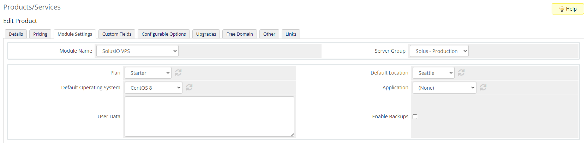

# SolusIO WHMCS VPS Provisioning module

## Description

SolusIO WHMCS VPS Provisioning module gives the ability to sell traditional-style prepaid VPS.

The module allows you to do the following virtual server actions:

* create
* destroy
* suspend
* unsuspend
* reboot
* boot
* shutdown

## Requirements

Minimum required **PHP** version is 7.4.

## Installation

* Download the latest package from our [releases page](https://github.com/solusio/solusiovps/releases)
* Extract the contents of the zip file to your WHMCS root directory

## Configuration

Open the Account page in the SolusIO user-area to generate an API Token.

Configure SolusIO API access by adding a new server in WHMCS. Required fields are `Hostname` and `Password`.

`Hostname` must contain URL without https, e.g. "www.solus.io"

SolusIO API Token should be saved in the password field.

Create a server group in WHMCS and assign the server which was created on the previous step.

## Product Configuration

Create a product in WHMCS and select `SolusIO VPS` as the linked module and the server group you configured previous.

Select the `Plan`, `Default Location` and `Default Operating System` or `Application` and save changes. If application is selected then the operating system is ignored.

### Optional Configuration

#### Locations

The module gives the ability to select a specific location on ordering of a product. This is done in the form of configurable options.

Create a configurable option named `Location`. Add options with the following convention: `locationId|locationName`. This will take priority over selected location in product module settings.

#### Operating Systems

The module gives the ability to select a specific operating system on ordering of a product. This is done in the form of configurable options.

Create a configurable option named `Operating System`. Add options with the following convention: `osId|osName`. This will take priority over selected operating system in product module settings.

#### SSH Key

The module gives the ability to specify an SSH key on ordering of a product. This is done in the form a product custom field.

Create a custom field named `SSH Key` and type `Text Area`.

#### Applications

Create corresponding product custom fields for applications with the same property names as defined in SolusIO.
